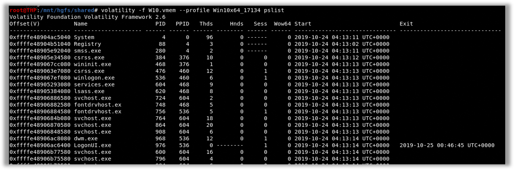
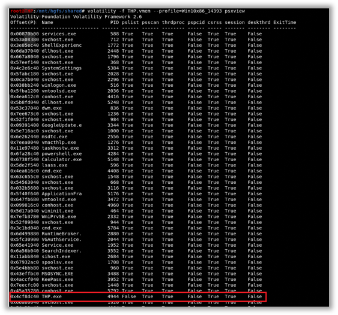
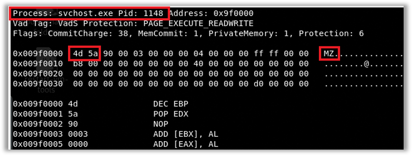

# Volatility Framework (volatility Version 2)

Volatility need three parameter:
- Memory Dump file
- OS profile ( In V3,  no need profile parameter)
- Plugin or Module


# To check OS profile

```bash
volatility -f memory.mem imageinfo
```
- the output show possible OS profile
- Sorted by the most possible one

# To list process `pslist`

```bash
volatility -f memory.mem --profile Win10x64 pslist
```




# Identify Hidden Process


## 1. `psscan` plugin 

- Malware, specifically rootkit often hide its existance by unlinking itself from link
- not show in output of `pslist`
- Scan by `psscan` to identify hidden process
- beaware of false positive

## `psscan` output as dot file to visualize parent child relation 

```bash
vol -f .\zeus.vmem --profile=WinXPSP2x86 psscan --output=dot --output-file=zeus.dot
```


## 2. `psxview` plugin

- use multiple technique to find process in memory
- display process is present or not for each detection technique



- `THP.exe` present on psscan but not in pslist (Hidden Process)

# Parent and Child process relationship using `pstree`

```bash
volatility -f memory.mem --profile=Win10x86 pstree
```

# Identify network connection 

- this tools also produce false positive

```bash
volatility -f memory.mem --profile=Win10x86 netscan

```

# Identifying process injection using `malfind`

- malfind output can see
    - `Process name`, `PID` where injection was detected
    - `Offset address`
    - `Hex`, `ASCII` and `Disassembly view` of injected area
    - may contain false positive

- Injected areas begin with the `MZ` header
- Partial output of `malfind` - `MZ` header detected



# File dump form memory using volatility

```bash
vol -f .\cridex.vmem --profile=WinXPSP3x86 memdump -p 1640 -D ./outputDir
```

# Suspicious Offsec  Detection

## Use filescan plugin and search files

```bash
vol -f .\cridex.vmem --profile=WinXPSP3x86 filescan
```
## Find suspicious files and note offset number and dump file 

```bash
vol -f .\cridex.vmem --profile=WinXPSP3x86 dumpfiles -Q 0x000000000238c778 -D ./outputDir
```

